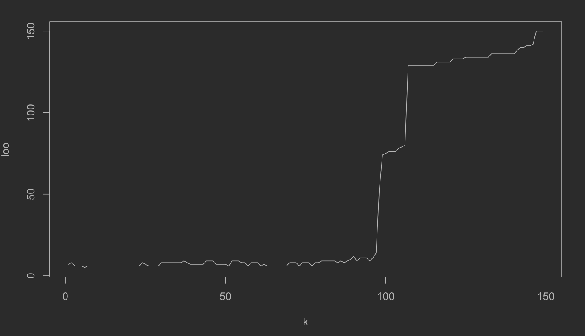

# Метрические алгоритмы классификации

## Лабораторная №1

### oneNN.R

Файл содержит скрипт на языке R, реализующий алгоритм классификации 1nn.
Данный алгоритм принимает на вход обучающую выбрку, представленную в виде
набора векторов-признаков и меток класса, и классфифицируемый объект,
а отдает метку класса объекта, который лежит к классифицируемому ближе
остальных (в соответствии с выбранной метрикой).

Функция ***EM*** - функция метрики, принимает на вход два вектора, отдает на
выход расстояние между векторами. Выбрана евклидова метрика.

Функция ***ruler*** измеряет расстояния от классифицируемого объекта до
элементов обучающей выборки. Принимает на вход классифицируемый объект, матрицу
векторов обучающей выборки и функцию метрики, отдает отсортированный по
возрастанию массив расстояний.

Функция ***oneNN*** реализует алгоритм 1nn. Принимает на вход классифицируемый
объект и матрицу признаков, отдает предполагаемый класс.

Далее приводится пример работы программы с отрисовкой графика: классифицируется
10 объектов,
обучающая выборка - ирисы Фишера.

### kNN.R

Файл содержит скрипт на языке R, реализующий алгоритм классификации knn.
В методе k ближайших соседей на вход алгоритму подается обучающая выборка и
классифицируемый объект, на выходе - класс объекта, совпадающий с классом
большинства из k ближайших соседей.

Функции ***EM*** и ***ruler*** аналогичны соответствующим из *oneNN.r*.

Функция ***kNN*** реализует алгоритм 1nn. Принимает на вход обучающую матрицу
признаков, массив меток, классифицируемый объект и количество k соседей.
Возвращает предполагаемый класс.

Однако оптимальное число k соседей, при котором функционал эмпирического риска
минимален, неизвестно. Для выяснения оптимального k пользуются оценкой
скользящего контроля. В данном скрипте используется алгоритм LOO.

Функция ***kNN_LOO*** принимает на вход матрицу признаков, метки, минимальное и
максимальное значение подбираемого параметра, флаг отрисовки графика. На выходе:
оптимальное значение параметра.

График зависимости ошибки от k:

Пример работы программы - классификация 10 рандомных точек:

### kwNN.R

Файл содержит скрипт на языке R, реализующий алгоритм классификации kwnn.
В методе k ближайших взвешенных соседей каждый из k голосов ближайших соседей
имеет некоторый вес w(i), при чем w(i) - невозрастающая функция. На вход
алгоритму подается обучающая выборка, классифицируемый объект число соседей k
и весовая функция w(i), а возвращается класс классифицируемого объекта.

Функции ***EM*** и ***ruler*** аналогичны соответствующим из *oneNN.r*.

Функция ***kwNN*** реализует алгоритм kwnn. Принимает на вход обучающую матрицу
признаков, массив меток, классифицируемый объект, количество k соседей и
знаменатель q геометрической прогрессии (в виде весовой функции выбрана
геометрическая прогрессия со знаменателем из полуинтервала (0, 1]). Возвращает
предполагаемый класс.

Оптимальное значение знаменателя геометрической прогрессии для нашей реализации
так же неизвестно, поэтому оно, как и k в kNN, подбирается алгоритмом LOO.
Подбор параметра q осуществляется функцияей ***kwNN_LOO***.

График зависимости ошибки от k:

Пример работы программы - классификация 10 рандомных точек:

Карта классификации ирисов Фишера алгоритмом kNN, при k = 6:

