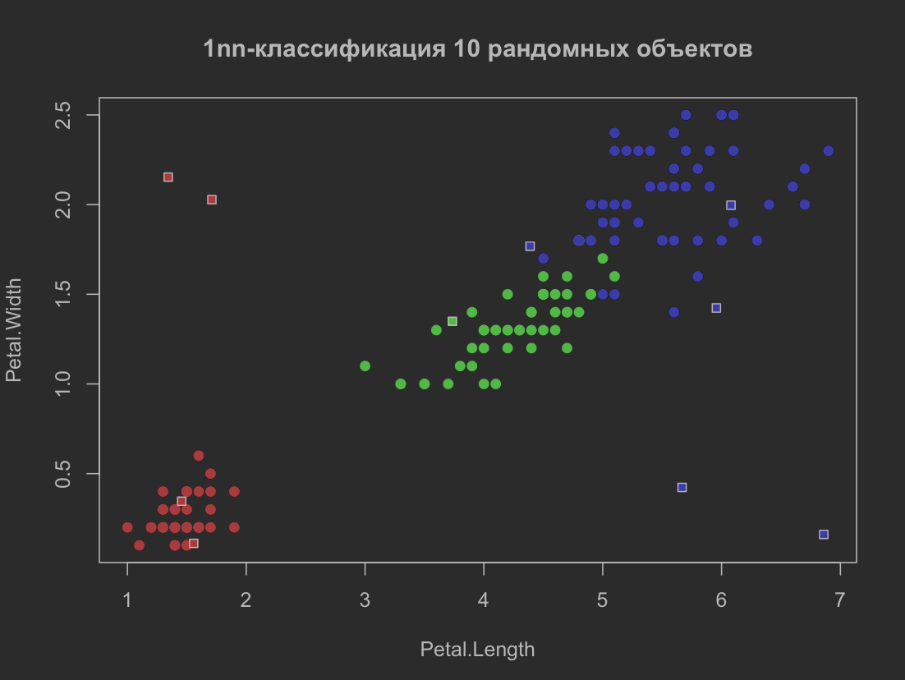
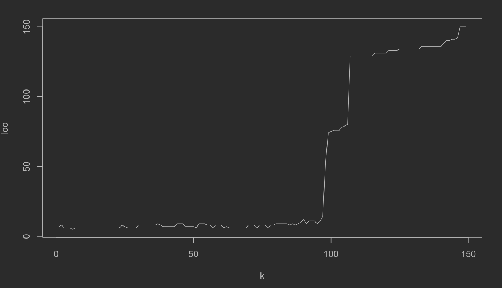
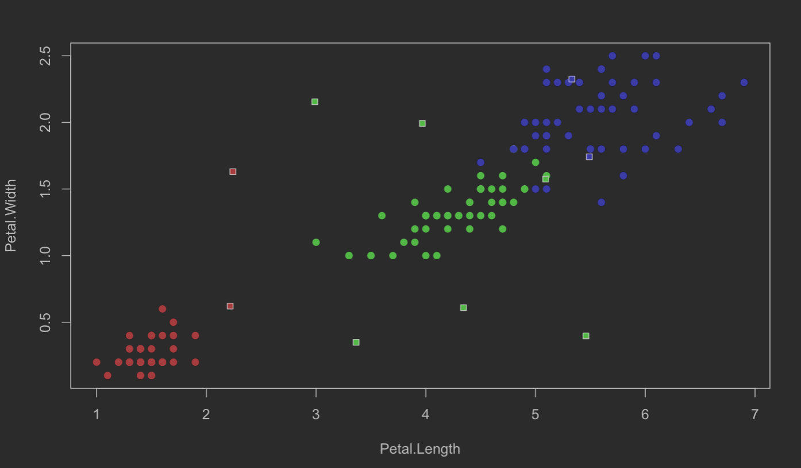
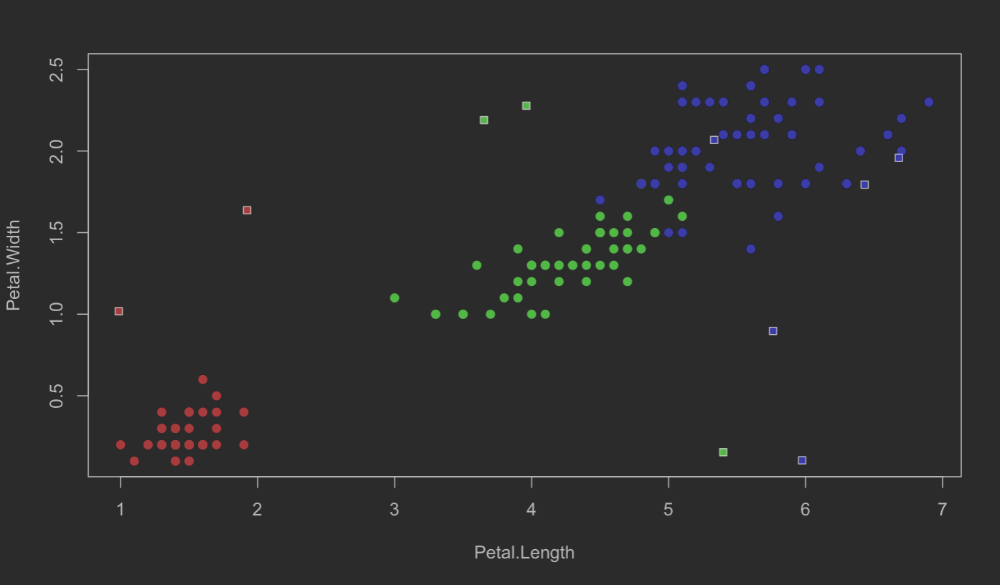
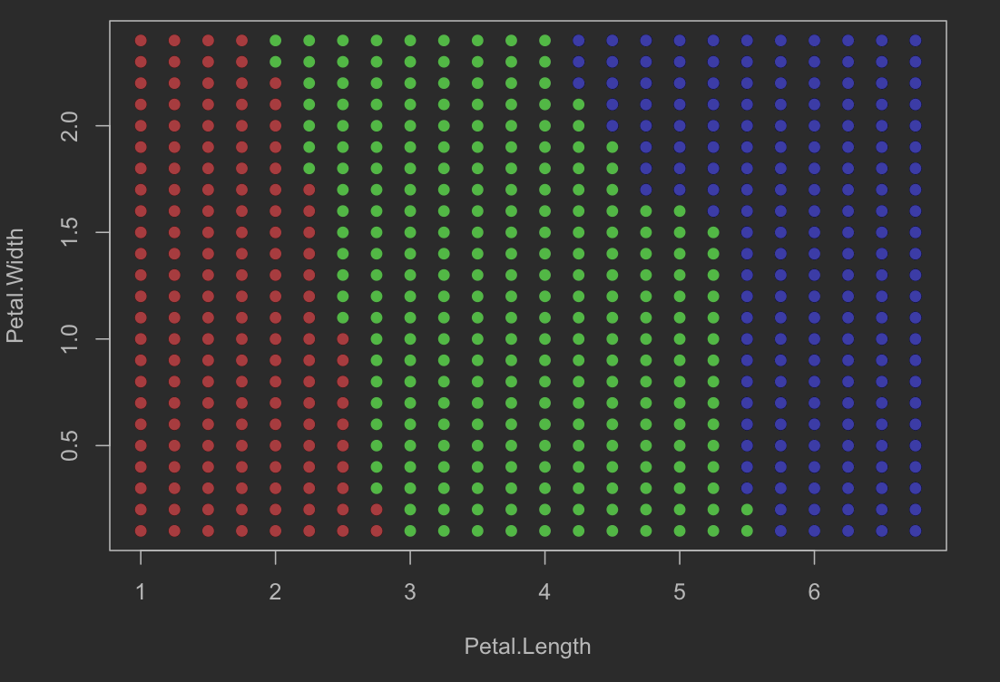

# Метрические алгоритмы классификации

Одной из областей применения машинного обучения является задача классификации:
есть некоторое, зараенее известное, множество классов и нам требуется отнести к
одному из них классифицируемый объект.

В метрических алгоритмах классификации суждения о принадлежности объекта к
классу основываются на некоторой функции метрики и на гипотезе компактности.
Гипотеза компактности говорит о том, что на схожих объектах алгоритм дает
одинаковые ответы или, другими словами, если объекты находятся в пространстве
рядом, то они относятся к одному классу.

## Лабораторная №1

### oneNN.R

Алгоритм 1nn - частный случай алгоритма knn. Он относит классифицируемый объект
к тому классу, элемент которого находится ближе всего к классифицируемому.

Однако такой алгоритм не очень устойчив к выбросам. Поэтому чаще пользуются
алгоритмом knn c настраиваемым параметром k.

Файл содержит скрипт на языке R, реализующий алгоритм классификации 1nn.
Данный алгоритм принимает на вход обучающую выбрку, представленную в виде
набора векторов-признаков и меток класса, и классфифицируемый объект,
а отдает метку класса объекта, который лежит к классифицируемому ближе
остальных (в соответствии с выбранной метрикой).

Функция ***EM*** - функция метрики, принимает на вход два вектора, отдает на
выход расстояние между векторами. Выбрана евклидова метрика.

Функция ***ruler*** измеряет расстояния от классифицируемого объекта до
элементов обучающей выборки. Принимает на вход классифицируемый объект, матрицу
векторов обучающей выборки и функцию метрики, отдает отсортированный по
возрастанию массив расстояний.

Функция ***oneNN*** реализует алгоритм 1nn. Принимает на вход классифицируемый
объект и матрицу признаков, отдает предполагаемый класс.

Далее приводится пример работы программы с отрисовкой графика: классифицируется
10 объектов,
обучающая выборка - ирисы Фишера.

### kNN.R

Алгоритм knn - алгоритм классификации, который относит классифицируемый объект
к тому классу, элементов которого больше среди первых k ближайших элементов
обучающей выборки.

Однако изначально непонятно при каком k функционал эмпирического риска будет
минимален. Для того, чтобы это выяснить пользуются критерием скользящего
контроля: обучающая выборка определенное количество раз, различным образом
делится на две непересекающиеся: на новую обучающую (training set) и на
проверяющую (test set), и модель обучается на неполных данных, а потом
оценивается количество ошибок на проверяющей выборке.
Мы используем алгоритм скользящего контроля LOO, в котором на каждом шаге в
проверяющую выборку входит лишь один объект и алгоритм осуществляет лишь l 
переобучений (где l - величина обучающей выборки).

Файл содержит скрипт на языке R, реализующий алгоритм классификации knn.
В методе k ближайших соседей на вход алгоритму подается обучающая выборка и
классифицируемый объект, на выходе - класс объекта, совпадающий с классом
большинства из k ближайших соседей.

Функции ***EM*** и ***ruler*** аналогичны соответствующим из *oneNN.r*.

Функция ***kNN*** реализует алгоритм 1nn. Принимает на вход обучающую матрицу
признаков, массив меток, классифицируемый объект и количество k соседей.
Возвращает предполагаемый класс.

Функция ***kNN_LOO*** принимает на вход матрицу признаков, метки, минимальное и
максимальное значение подбираемого параметра, флаг отрисовки графика. На выходе:
оптимальное значение параметра.

График зависимости ошибки от k:

Пример работы программы - классификация 10 рандомных точек:

### kwNN.R

В алгоритме knn голоса всех k соседей равны. В некоторых задачах это приводит
к большему числу ошибок. С этим помогает справиться алгоритм kwnn, в котором
каждому соседу, в зависимости от его ранга, присваивается значение некоторой
невозрастающей функции w(i), где i - это ранг соседа. Получается, что в этом
алгоритме добавляется еще один настраиваемый параметр - вес голоса соседа,
оптимальное значение которого подбирается с помощью LOO.
 
Файл содержит скрипт на языке R, реализующий алгоритм классификации kwnn.
В методе k ближайших взвешенных соседей каждый из k голосов ближайших соседей
имеет некоторый вес w(i), при чем w(i) - невозрастающая функция. На вход
алгоритму подается обучающая выборка, классифицируемый объект число соседей k
и весовая функция w(i), а возвращается класс классифицируемого объекта.

Функции ***EM*** и ***ruler*** аналогичны соответствующим из *oneNN.r*.

Функция ***kwNN*** реализует алгоритм kwnn. Принимает на вход обучающую матрицу
признаков, массив меток, классифицируемый объект, количество k соседей и
знаменатель q геометрической прогрессии (в виде весовой функции выбрана
геометрическая прогрессия со знаменателем из полуинтервала (0, 1]). Возвращает
предполагаемый класс.

Функция ***kwNN_LOO*** аналогична функции ***kNN_LOO*** из файла *kNN.R*.

График зависимости ошибки от k:

Пример работы программы - классификация 10 рандомных точек:

Карта классификации ирисов Фишера алгоритмом kNN, при k = 6:

