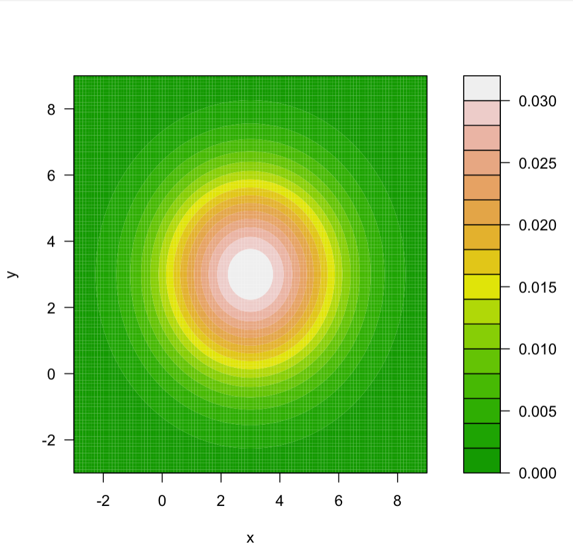
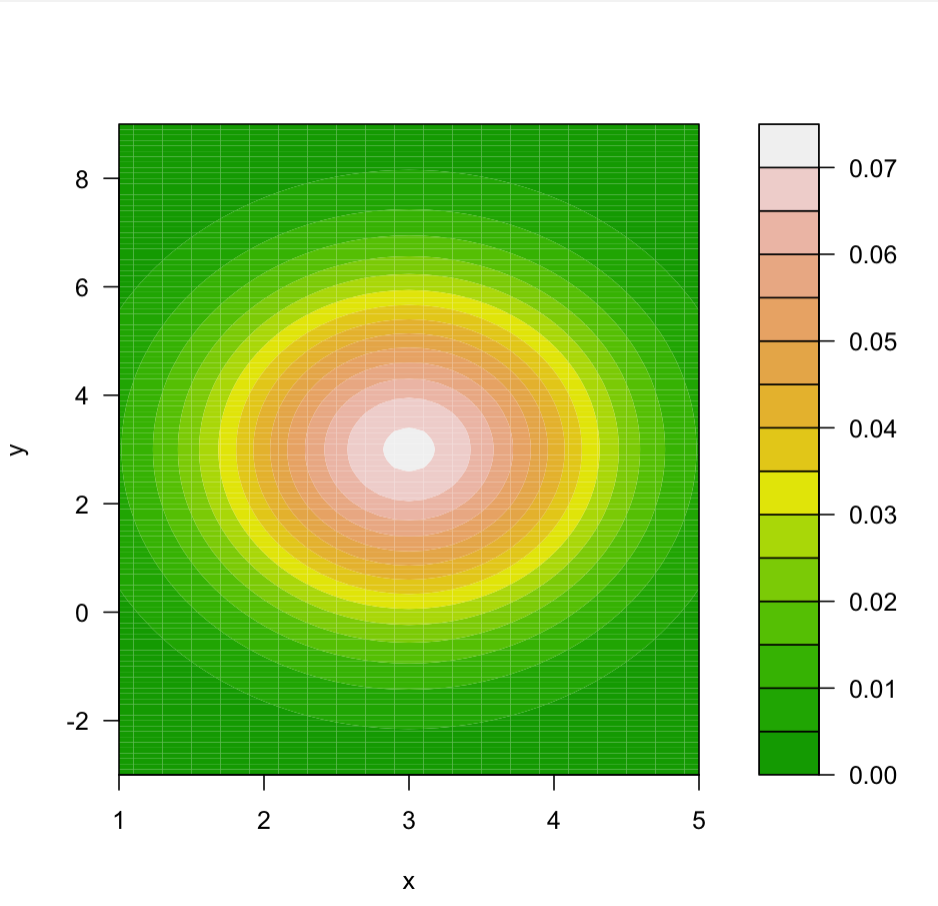
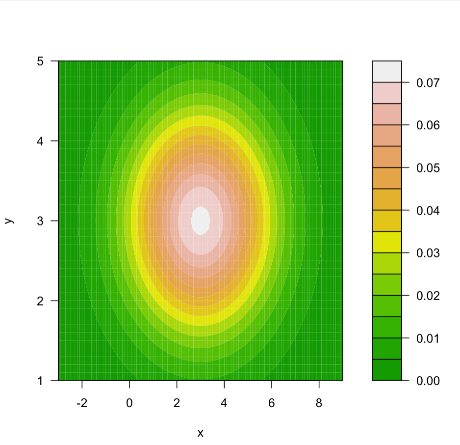
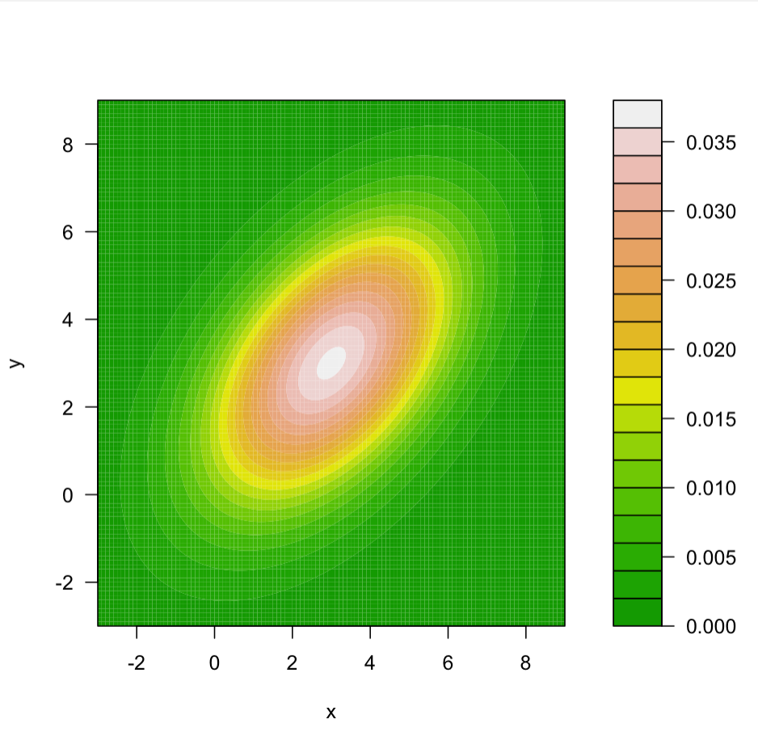
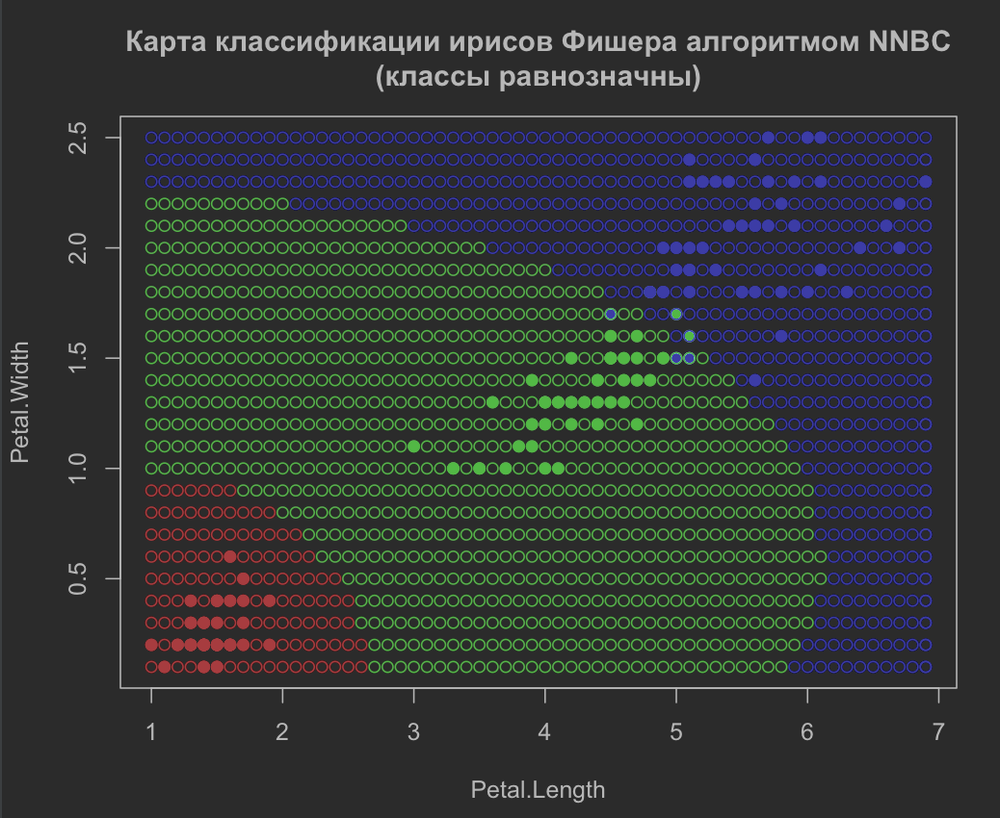
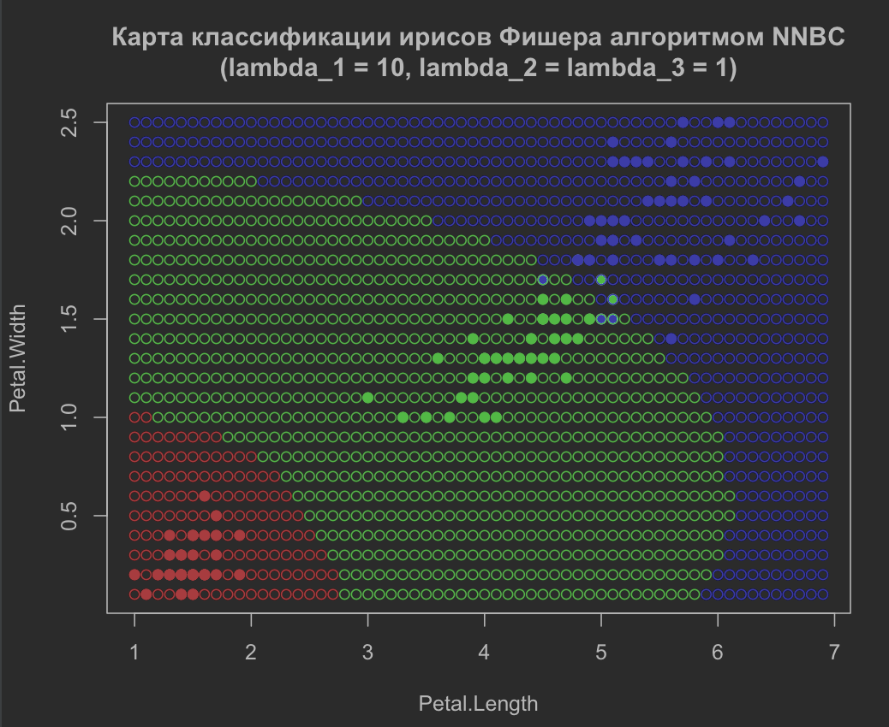
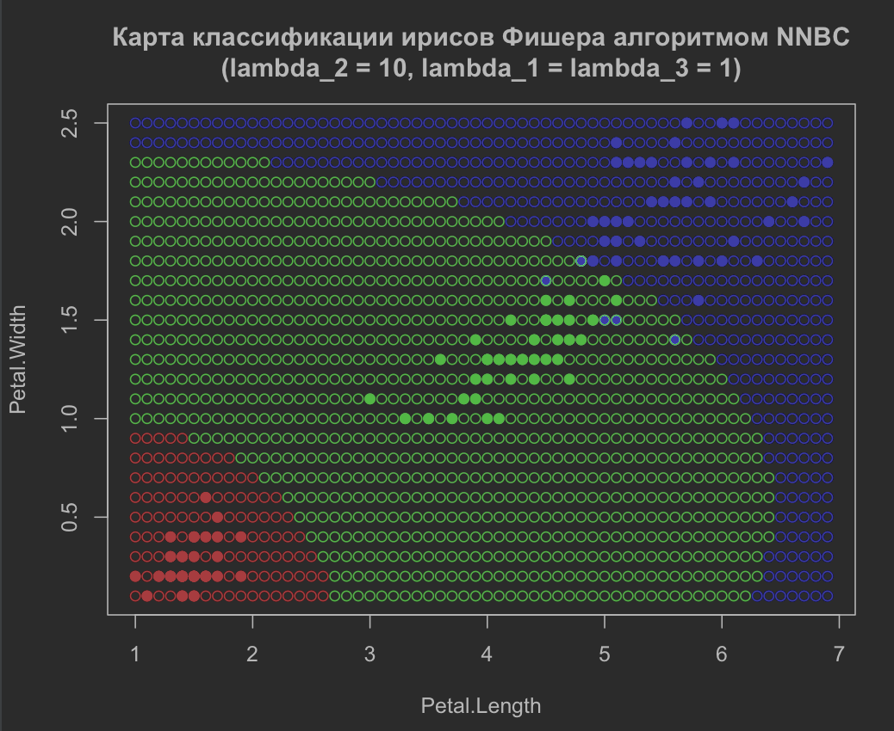
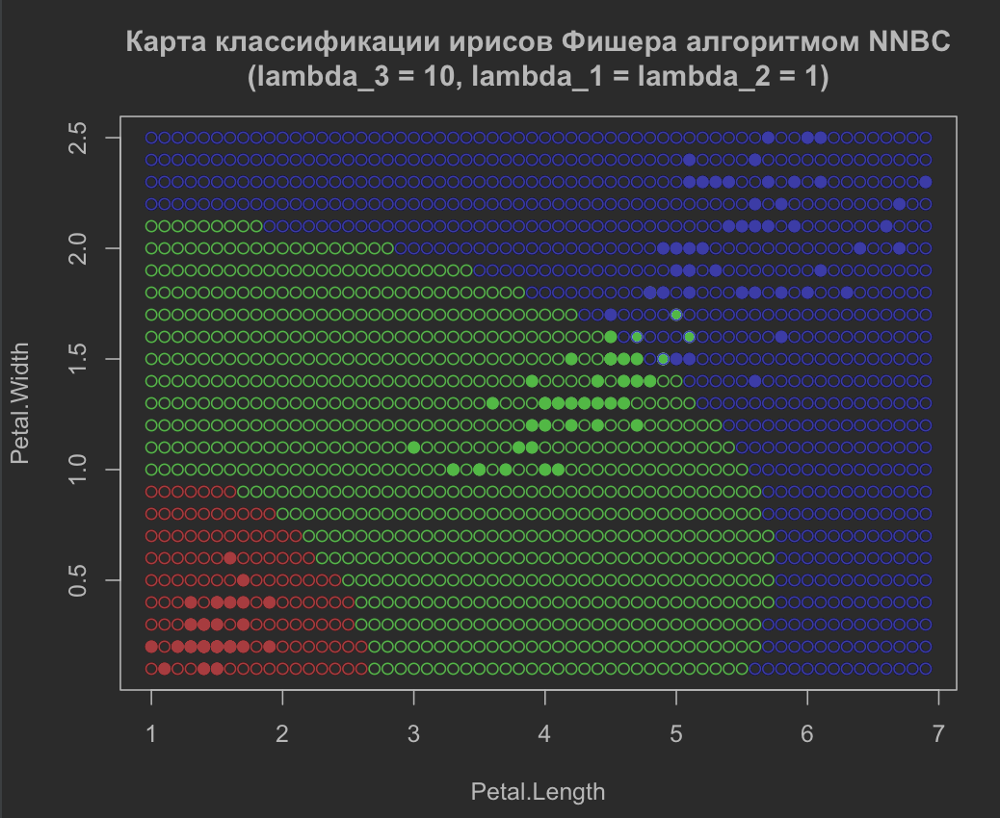

# Метрические алгоритмы классификации

 0. [Лабораторная 1] (#Лабораторная-1)
     1. [kNN] (#kNN/oneNN.R)


Одной из областей применения машинного обучения является задача классификации:
есть некоторое, зараенее известное, множество классов и нам требуется отнести к
одному из них классифицируемый объект.

В метрических алгоритмах классификации суждения о принадлежности объекта к
классу основываются на некоторой функции метрики и на гипотезе компактности.
Гипотеза компактности говорит о том, что на схожих объектах алгоритм дает
одинаковые ответы или, другими словами, если объекты находятся в пространстве
рядом, то они относятся к одному классу.

Сравнение осуществленных алгоритмов:
|Алгоритм       |параметры           |ошибка|
|---------------|--------------------|------|
|1NN            |k = 1               |7     |
|kNN            |k = 6               |5     |
|**kwNN**       |**k = 3, q = 0.7**  |**6** |
|Parzen         |h = 0.4             |6     |
|Potential      |h = 0.4,            |6     |

<table>
 <tr>
  <td>
   
  </td>
  <td>
   
  </td>
</tr>

 <tr>
  <td>
   
  </td>
  <td>
   
  </td>
 </tr>
</table>

## Лабораторная 1

## lab1
[Оглавление](#Оглавление)

### kNN/oneNN.R
*Метод 1-го ближайщего соседа.*

Алгоритм 1nn - частный случай алгоритма knn. Он относит классифицируемый объект
к тому классу, элемент которого находится ближе всего к классифицируемому.

Однако такой алгоритм не очень устойчив к выбросам. Поэтому чаще пользуются
алгоритмом knn c настраиваемым параметром k.

Файл содержит скрипт на языке R, реализующий алгоритм классификации 1nn.
Данный алгоритм принимает на вход обучающую выбрку, представленную в виде
набора векторов-признаков и меток класса, и классфифицируемый объект,
а отдает метку класса объекта, который лежит к классифицируемому ближе
остальных (в соответствии с выбранной метрикой).

Функция ***EM*** - функция метрики, принимает на вход два вектора, отдает на
выход расстояние между векторами. Выбрана евклидова метрика.

Функция ***ruler*** измеряет расстояния от классифицируемого объекта до
элементов обучающей выборки. Принимает на вход классифицируемый объект, матрицу
векторов обучающей выборки и функцию метрики, отдает отсортированный по
возрастанию массив расстояний.

Функция ***oneNN*** реализует алгоритм 1nn. Принимает на вход классифицируемый
объект и матрицу признаков, отдает предполагаемый класс.

Далее приводится пример работы программы с отрисовкой графика: классифицируется
10 объектов,
обучающая выборка - ирисы Фишера.


### kNN/kNN.R
*Метод k ближайших соседей.*

Алгоритм knn - алгоритм классификации, который относит классифицируемый объект
к тому классу, элементов которого больше среди первых k ближайших элементов
обучающей выборки.

Однако изначально непонятно при каком k функционал эмпирического риска будет
минимален. Для того, чтобы это выяснить пользуются критерием скользящего
контроля: обучающая выборка определенное количество раз, различным образом
делится на две непересекающиеся: на новую обучающую (training set) и на
проверяющую (test set), и модель обучается на неполных данных, а потом
оценивается количество ошибок на проверяющей выборке.
Мы используем алгоритм скользящего контроля LOO, в котором на каждом шаге в
проверяющую выборку входит лишь один объект и алгоритм осуществляет лишь l 
переобучений (где l - величина обучающей выборки).

Файл содержит скрипт на языке R, реализующий алгоритм классификации knn.
В методе k ближайших соседей на вход алгоритму подается обучающая выборка и
классифицируемый объект, на выходе - класс объекта, совпадающий с классом
большинства из k ближайших соседей.

Функции ***EM*** и ***ruler*** аналогичны соответствующим из *oneNN.R*.

Функция ***kNN*** реализует алгоритм 1nn. Принимает на вход обучающую матрицу
признаков, массив меток, классифицируемый объект и количество k соседей.
Возвращает предполагаемый класс.

Функция ***kNN_LOO*** принимает на вход матрицу признаков, метки, минимальное и
максимальное значение подбираемого параметра, флаг отрисовки графика. На выходе:
оптимальное значение параметра.

График зависимости ошибки от k:


Пример работы программы - классификация 10 рандомных точек:


Карта классификации ирисов Фишера алгоритмом kNN, при k = 6:


### kwNN/kwNN.R
*Метод k взвешенных ближайших соседей.*

В алгоритме knn голоса всех k соседей равны. В некоторых задачах это приводит
к большему числу ошибок. С этим помогает справиться алгоритм kwnn, в котором
каждому соседу, в зависимости от его ранга, присваивается значение некоторой
невозрастающей функции w(i), где i - это ранг соседа. Получается, что в этом
алгоритме добавляется еще один настраиваемый параметр - вес голоса соседа,
оптимальное значение которого подбирается с помощью LOO.
 
Файл содержит скрипт на языке R, реализующий алгоритм классификации kwnn.
На вход алгоритму подается обучающая выборка, классифицируемый объект число
соседей k и весовая функция w(i), а возвращается класс классифицируемого
объекта.

Функции ***EM*** и ***ruler*** аналогичны соответствующим из *oneNN.R*.

Функция ***kwNN*** реализует алгоритм kwnn. Принимает на вход обучающую матрицу
признаков, массив меток, классифицируемый объект, количество k соседей и
знаменатель q геометрической прогрессии (в виде весовой функции выбрана
геометрическая прогрессия со знаменателем из интервала (0, 1). Возвращает
предполагаемый класс.

Функция ***kwNN_LOO*** аналогична функции ***kNN_LOO*** из файла *kNN.R*.

Тепловая карта зависимости ошибки от k и q:


Пример работы программы - классификация 10 рандомных точек:


Карта классификации ирисов Фишера алгоритмом kwNN, при k = 3, q = 0.6:


Пример, показывающий преимущество метода kwNN над kNN:
- kNN-классификация объекта:


- kwNN-классификация объекта:


## Лабораторная №2

### parzen/parzen.R
*Метод парзеновского окна.*

В алгоритме k взвешенных ближайших соседей вес голосу соседа присваивается
в зависимости от ранга соседа. Этот подход не всегда приводит к желаемым
результатам. Вместо него можно использовать *метод парзеновского окна*, в котором
вес голосу соседа присваивается в зависимости от расстояния, на котором
находится сосед, а соседями считаются все объекты обучающей выборки, которые
находятся в некоторой h-окрестности классифицируемого объекта.

Файл содержит скрипт на языке R, реализующий алгоритм классификации с помощью
метода парзеновского окна.

Функции ***EM*** и ***ruler*** аналогичны соответствующим из *oneNN.R*.

Функции ***epan***, ***quar***, ***tria***, ***gaus***, ***rect*** - ядра
Епанечникова, квартическое, треугольное, гауссовское, прямоугольное
соответственно. Вход: вещественное число, выход: вещественное число - значение
ядра в этой точке.

Функция ***parzen*** реаизует метод парзеновского окна. Вход: матрица признаков,
вектор меток, классифицируемый объект, ширина окна h, функция ядра.
Выход: класс.

Функция ***parzen_LOO*** подбирает оптимальный параметр h ширины окна.
Вход: матрица признаков, вектор меток, минимальное и максимальное значение
параметра, ядро и флаг отрисовки графика. Выход: оптимальное значение h.

Далее приведены графики loo-функций для разных ядер:
- ядро Епанечникова:

- гауссовское ядро:

- квартическое ядро:

- прямоугольное ядро:

- треугольное ядро:


Карты классификации для разных ядер:
- ядро Епанечникова:

- гауссовское ядро:

- квартическое ядро:

- прямоугольное ядро:

- треугольное ядро:


## Лабораторная №3

### poten/poten.R
*Метод потенциальных функций.*

Если в методе парзеновского окна центр окна помещать не в классифицируемый
объект, а в обучающий, при чем у каждого обучающего объекта своя ширина окна
и каждый обучающий объект обладает некоторым потенциалом - неотрицательным
числом, на которое домножаются ядра, то получим метод потенциальных функций.

Файл содержит скрипт на языке R, реализующий алгоритм классификации с помощью
метода потенциальных функций.

Функции ***EM*** и ***ruler*** аналогичны соответствующим из *oneNN.R*.

Функции ***epan***, ***quar***, ***tria***, ***gaus***, ***rect*** аналогичны
соответствующим из *parzen.R*.

Функция ***poten*** реализует метод потенциалов. Вход: матрица признаков,
вектор меток, классифицируемый объект, функция ядра, вектор ширин окон h и
вектор потенциалов gamma. Выход: класс.

Функция ***gamma_set*** подбирает значения потенциалов gamma. 
Вход: матрица признаков, вектор меток и допустимое значние ошибок.
Выход: вектор потенциалов.

Карта выборки с учетом потенциалов объектов:


Карта классификации:
- с учетом потенциалов:

- без:


## Лабораторная №4

### margin/margin.R
*Отступы*

Часто возникает такая проблема: обучающая выборка сильно большая, что приводит
к увеличению времени обучения модели. Чтобы решить эту проблему пользуются
алгоритмами, связанными с понятием отступа. Отступы показывают степень
типичности объекта для его класса относительно какого-либо алгоритма и
считаются так: отступ = (оценка принадлежности объекта своему классу) -
(максимум из оценок принадлежности другим классам).

Файл содержит скрипт на языке R, отрисовывающий график зависимости отступа от
элемента выборки ирисов Фишера относительно алгоритма парзеновского окна, с
шириной окна - 0.4.

Функции ***EM*** и ***ruler*** аналогичны соответствующим из *oneNN.R*.

Функции ***epan***, ***parzen*** аналогичны соответствующим из *parzen.R*.

Функция ***margin*** считает отсутп элемента относительно обучающей выборки
и алгоритма парзеновского окна. Вход: матрица признаков, вектор классов,
элемент, для которого считается отступ, номер этого элемента в списке
ирисов Фишера. Выход: посчитанный отступ.

Функция ***margin_plot*** считает отступы для всех элементов обучающей выборки,
сортирует их по возрастанию и отрисовывает. Вход: матрица признаков и вектор
классов.

График отступов ирисов Фишера:


*Алгоритм крутого склона*

Алгоритм крутого склона позволяет убрать из выборки шумы (элементы с большим
отрицательным отступом). Все отступы сортируются в порядке их возрастания,
затем находится такой элемент с отрицаетльным отступом, у которого разность
отступов с предыдущим максимальна среди всех соседних элементов с
отрицатлеьными отступами, после чего все элементы до найденного убираются из
обучающей выборки.

Функция ***cool_descent*** реализует алгоритм крутого склона. Вход: массив
отступов. Выход: массив отступов без шумов.

### STOLP.R

*Алгоритм STOLP*

Одним из алгоритмов, решающих проблему минимизации обучающих данных, является
STOLP-алгоритм. Он, изначально посчитав отступы обучающей выборки, выбирает
из каждого класса по одному элементу с наибольшим отступом, и добавляет в
множество Ω, далее он смотрит отступы элементов обучающей выборки без элементов
множества Ω, и
- если количество элементов с отрицательным отступом не превышает
некоторой, заранее заданной, допустимой величины, то он преращает выполнение
алгоритма, а множество Ω - множество эталонов,
- иначе он добавляет в Ω элемент с наименьшим отступом и заново проверят
отступы оставшихся элементов обучающей выборки.

Функции ***EM*** и ***ruler*** аналогичны соответствующим из *oneNN.R*.

Функции ***epan***, ***parzen*** аналогичны соответствующим из *parzen.R*.

Функция ***margin*** считает отступы элементов некоторого множества
относительно другого множества и некоторого алгоритма. Вход: матрица признаков,
вектор классов, матрица признаков и вектор классов объектов, для которых
считаются отступы. Выход: матрица, в столбцах который: значения признаков,
класс, отступ объектов, для которых считали отступ.

Функция ***err*** считает отступы объектов обучающей выборки.
Вход: матрица признаков, вектор классов. Выход аналогичен выходу функции
***margin***.

Функция ***STOLP*** реализует алгоритм STOLP. Вход: матрица признаков, вектор
классов, значение допустимой ошибки. Выход: множество эталонов.

Листинг:
```R
#считает все отступы множества для классификации относительно обучающего множества
margin <- function(feature_matrix, labels, classification_set, classification_set_labels) {
  l <- dim(classification_set)[1]
  #матрица, содержащая координаты, класс и отступ элемента
  M <- matrix(0, 0, 4)
  for (i in 1:l) {
    z <- classification_set[i,]
    cnt <- parzen(feature_matrix, labels, z, 0.4, epan)
    w1 <- cnt[classification_set_labels[i]]
    cnt[classification_set_labels[i]] <- 0
    w2 <- cnt[which.max(cnt)]
    m <- w1 - w2
    M <- rbind(M, c(classification_set[i,1], classification_set[i,2], as.integer(classification_set_labels[i]), m))
  }
  M <- M[order(M[,4]),]
  return(M)
}

#считает отступ для каждого айриса относительно всего множества без выбранного элемента
err <- function (feature_matrix, labels) {
  l <- dim(feature_matrix)[1]
  M <- matrix(0,0,4)
  for (i in 1:l) {
    tmp_feature_matrix <- feature_matrix[-i]
    tmp_labels <- labels[-i]
    cnt <- parzen(tmp_feature_matrix, tmp_labels, feature_matrix[i,], 0.4, epan)
    w1 <- cnt[labels[i]]
    cnt[labels[i]] <- 0
    w2 <- cnt[which.max(cnt)]
    m <- w1 - w2
    M <- rbind(M, c(feature_matrix[i,1], feature_matrix[i,2], as.integer(labels[i]), m))
  }
  M <- M[order(M[,4]),]
  return(M)
}

#алгоритм STOLP
STOLP <- function (feature_matrix, labels, l0) {
  #подсчет отступов на всех айрисах 
  #M <- err(feature_matrix, labels)
  ############################################################################
  #загрузка отсупов всех айрисов из файла
  M <- read.csv("margin_STOLP_tmp.txt")
  l <- dim(M)[1]
  n <- dim(M)[2]
  tmp <- matrix(0, l, (n - 1))
  for (i in 1:l){
    tmp[i,] <- c(M[i, 2], M[i, 3], M[i, 4], M[i, 5])
  }
  M <- tmp
  ############################################################################
  #удаление из выборки шумов и ошибок
  i <- 1
  while (M[i, 4] <= 0) {
    M <- M[-i,]
  }

  l <- dim(M)[1]
  omega <- matrix(0,0,3)
  index <- vector()
  for (i in 1:3) {
    index[i] <- 0
  }
  #добавляем в множество эталонов Ω по одному эталонному объекту из каждого класса
  for (i in l:1) {
    if (M[i, 3] == 1 & index[1] == 0) {
      omega <- rbind(omega, M[i, 1:3])
      index[1] <- i
    }
    if (M[i, 3] == 2 & index[2] == 0) {
      omega <- rbind(omega, M[i, 1:3])
      index[2] <- i
    }
    if (M[i, 3] == 3 & index[3] == 0) {
      omega <- rbind(omega, M[i, 1:3])
      index[3] <- i
    }
    if (index[1] != 0 & index[2] != 0 & index[3] != 0) {
      break
    }
  }
  #удаляем из выборки добавленные в Ω эталоны
  index <- index[order(index)]
  for (i in 3:1) {
    M <- M[-index[i],]
  }
  l <- dim(M)[1]

  # тут надо бы добавить проверку множеств Ω и X на совпадение
  
  #добавление новых элементов  в Ω до достижения нужного качества классификации на эталонах
  erro <- l #количество эл-тов, на которых ошиблись
  while (erro > l0) {
    erro <- 0
    i <- 1
    #отступы элементов исходной выборки относительно Ω
    tmpM <- margin(omega[,1:2], omega[,3], M[,1:2], M[,3])
    while(tmpM[i, 4] <= 0) {
      erro <- erro + 1
      i <- i + 1
    }
    #добавление элемента с наименьшим отступом
    omega <- rbind(omega, tmpM[1,1:3])
    #удаление этого элемента из исходной выборки
    M <- tmpM[-1,]
  }
  #print(omega)
  return(omega)
}
omega <- STOLP(iris[,3:4], iris[,5], 10)
```

Множество эталонов ирисов Фишера для алгоритма парзеновского окна с
ядром Епанечникова, шириной окнв - 0.4:


# Байесовские алгоритмы классификации

## Лабораторная №5

### level_curves/level_curves.R

*Линии уровня*

Одним из способов представления функций многих переменных являются линии
уровня: на разных значениях n-мерной функции проводятся гипперплоскости и все
точки пересечения этой гипперплоскости с функцией отображаются на (n-1)-мерное
пространство. Для функции двух переменных эти точки пересечения отображаются
на плоскость XOY.

Файл содержит скрипт на языке R, отрисовывающий линии уровня для заданного
n-мерного нормального распределения (которое задается матожиданием и матрицей
ковариации).

Функция ***density*** считает значение плотности распределения с определенными
матожиданием и матрицей ковариации в точке. Вход: координаты точки, матождание
и матрица ковариации. Выход: значение плотности в точке.

Функция ***plotin*** отрисовывает линии уровня плотности распределения.
Вход: матожидание и матрица ковариации.

Графики линий уровня нормального распределения с разными матрицами ковариации
и одинаковым матожиданием (М = (3, 3)):
- некорелированные признаки, одинаковые дисперсии:
<table>
  <tr>
    <td>
      
    </td>
    <td>
      
    </td>
  </tr>
</table>

- некорелированные признаки, разные дисперсии:
<table>
  <tr>
    <td>
      
    </td>
    <td>
      
    </td>
  </tr>
  <tr>
    <td>
      
    </td>
    <td>
      
    </td>
  </tr>
</table>

- корелированные признаки, разные дисперсии:
<table>
  <tr>
    <td>
      
    </td>
    <td>
      
    </td>
  </tr>
</table>


## Лабораторная №6

### NNBC/NNBC.R

*Нормальный наивный байесовский классификатор*

Существует отличный от предыдущих подход к задачам классификации: вместо того,
чтобы искать апроксимирующую зависимость между обучающей выбркой и множеством
классов, ищется плотность распределения вероятносного пространства (Х, Y),
где Х - обучающая выборка, а Y - множество классов.

Оптимальный байесовский классификатор.
Алгоритм,который относит классифицируемый объект к тому классу, для котрого
максимально произведение: lambda_y * P_y * p_y, где lambda_y величина потери
на классе у, P_y - априорная вероятность класса у, p_y - функция правдоподобия
класса y.

Наивный байесовский классификатор.
Алгоритм оптимального байесовского классификатора, который предполагает, что
все признаки объекта независимы и функция правдоподобия класса представима в
виде произведения покоординатных функций правдоподобия.

Нормальный наивный байесовский классификатор.
Наивный байесовский классификатор, полагающий, что все признаки нормально
распределены для каждого класса.

Функция ***mat_expect*** считает матожидание случайной величины. Вход: элементы
одного класса, их вероятности. Выход: матожидание класса.

Функция ***dispersion*** считает дисперсию случайной величины. Вход: элементы
одного класса, их вероятности. Выход: дисперсия класса.

Функция ***NNBC*** реализует алгоритм ННБК. Вход: классифицируемый объект,
обучающая выборка, вектор меток класса, количество классов, вектор потерь.
Выход: предполагаемый класс.

Функция ***norm_dencity*** считает плотность заданного нормального
распределения в точке. Вход: точка, матожидание, дисперсия. Выход: плотность.

Листинг:

```R
#мат ожидание случайного вектора
mat_expect <- function(feature_matrix, probability) {
  l <- dim(feature_matrix)[1]
  n <- dim(feature_matrix)[2]
  sum <- rep(0, n)
  for (i in 1:l) {
    sum <- sum + feature_matrix[i,] * probability[i]
  }
  return(sum)
}

dispersion <- function(feature_matrix, probability) {
  l <- dim(feature_matrix)[1]
  n <- dim(feature_matrix)[2]
  E <- mat_expect(feature_matrix, probability)
  for_ME <- matrix(0,0, n)
  for (i in 1:l) {
    for_ME <- rbind(for_ME, ((feature_matrix[i,] - E) ^ 2))
  }
  return(mat_expect(for_ME, probability))
}

norm_dencity <- function(ksi, mu, sigma) {
  first <- 1 / (sigma * sqrt(2 * pi))
  second <- exp(-((ksi - mu) ^ 2) / (2 * sigma ^ 2))
  return(first * second)
}

#алгоритм ННБК
NNBC <- function(z, feature_matrix, labels, class_quan, lambda){
  l <- dim(feature_matrix)[1]
  n <- dim(feature_matrix)[2]
  p <- rep(0, class_quan)
  E <- matrix(0, 0, n)
  D <- matrix(0, 0, n)

  #Подсчет матодиланий и дисперсий всех классов
  for (i in 1:class_quan){
    left <- (i - 1) * 50 + 1
    right <- (i - 1) * 50 + 50
    E <- rbind(E, mat_expect(feature_matrix[left:right,], rep(1/50, 50)))
    D <- rbind(D, dispersion(feature_matrix[left:right,], rep(1/50, 50)))
  }

  #Подсчет априорных вероятностей классов
  for (i in 1:l) {
    if (as.integer(labels[i]) == 1) {
      p[1] <- p[1] + 1
    }
    if (as.integer(labels[i]) == 2) {
      p[2] <- p[2] + 1
    }
    if (as.integer(labels[i]) == 3) {
      p[3] <- p[3] + 1
    }
  }
  p <- p / l

  cnt <- c("setosa" =  0, "versicolor" = 0,  "virginca" = 0)
  for (i in 1:class_quan) {
    ln_pu <- 0
    for (j in 1:n) {
      ln_pu <- ln_pu + log(norm_dencity(z[j], E[i, j], sqrt(D[i, j])))
    }
    cnt[i] <- log(lambda[i]) + log(p[i]) + ln_pu
  }
  return(which.max(cnt))
}
```

Карты классификации классов ирисов Фишера, для различных значений потерь:

<table>
  <tr>
    <td>
     &#955;_1 = 1<br/>
     &#955;_2 = 1<br/>
     &#955;_3 = 1<br/>
    </td>
    <td>
      
    </td>
  </tr>

  <tr>
    <td>
     &#955;_1 = 10<br/>
     &#955;_2 = 1<br/>
     &#955;_3 = 1<br/>
    </td>
    <td>
      
    </td>
  </tr>

  <tr>
    <td>
     &#955;_1 = 1<br/>
     &#955;_2 = 10<br/>
     &#955;_3 = 1<br/>
    </td>
    <td>
      
    </td>
  </tr>

  <tr>
    <td>
     &#955;_1 = 1<br/>
     &#955;_2 = 1<br/>
     &#955;_3 = 10<br/>
    </td>
    <td>
      
    </td>
  </tr>
</table>


## Лабораторная №7

### plug_in/plug_in.R

*Подстановочный алгоритм*

В данном алгоритме, в отличии от ННБК, не строится предположение о
представимости функции правдоподоюия классов в виде покоординатного
произведения, а строится эмпирическая оценка ковариационной матрицы и функция
правлоподобия классов представляется как плотность многомерного нормального
распрделения.

